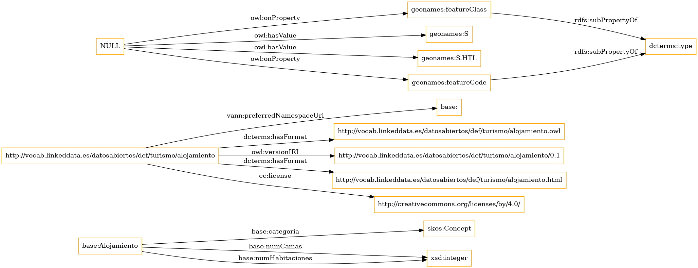

# Gister Questionnair

## Welcome to our Questionnair

This contains the images for the questionnair sent to you. *Make sure to put your answers in the google form and not here.*

### Q4. Which diagram do you prefer to see when deciding if the ontology might be relevant or not?

1. 

 

2.

3.

4.

<iframe></iframe>

### Q5. Which diagram do you prefer to see when deciding if the ontology might be relevant or not?

### Q6. Which diagram do you prefer to see when deciding if the ontology might be relevant or not?

### Q7. Which diagram do you prefer to see when deciding if the ontology might be relevant or not?

